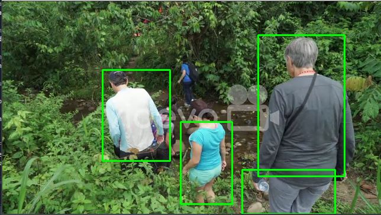
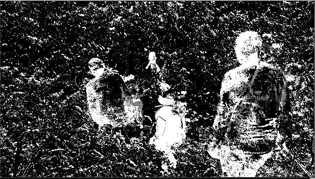

# Motion Detection using OpenCV

This repository contains a Python script that performs motion detection using OpenCV. It utilizes the `BackgroundSubtractorMOG2()` function from OpenCV to detect moving objects in a video stream or a video file.

## Code Description

The Python script uses the OpenCV library to perform motion detection. It applies background subtraction to separate the foreground (moving objects) from the background in each frame. The script then applies thresholding and contour detection to identify and draw bounding rectangles around the detected objects. The resulting frames, along with the foreground mask, are displayed in separate windows.

  

## Practical Applications in Industry

Motion detection has a wide range of practical applications in various industries, including:

- Surveillance Systems: Motion detection is commonly used in security systems for real-time monitoring and identification of intruders or suspicious activities.
- Video Analytics: Motion detection can be used for analyzing video data in applications such as traffic monitoring, crowd management, and behavior analysis.
- Human-Computer Interaction: Motion detection can enable gesture recognition and tracking, enabling natural and intuitive interaction between humans and computer systems.
- Robotics: Motion detection can be employed in robotics for object tracking, obstacle detection, and path planning.

## Future Scope

The motion detection script provided here serves as a foundation for further development and customization. Here are some potential areas for future enhancement:

- Object Tracking: Extend the code to track the detected objects across multiple frames, enabling more advanced tracking functionalities.
- Event Notification: Implement a mechanism to send notifications or trigger actions based on specific motion events, such as sending alerts or capturing images/videos when significant motion is detected.
- Machine Learning Integration: Explore the integration of machine learning techniques for improved object detection and classification in motion detection applications.
- Multi-Camera Support: Enhance the code to support multiple camera feeds or video files simultaneously, enabling multi-camera surveillance or analysis scenarios.

Feel free to fork this repository and adapt the code to suit your specific needs or contribute to its further development.

## Requirements

- Python 3.x
- OpenCV (cv2) library

## Usage

1. Clone the repository or download the `motion_detection.py` script.
2. Install the required dependencies: `pip install opencv-python`.
3. Run the script by providing the video path as an argument:
